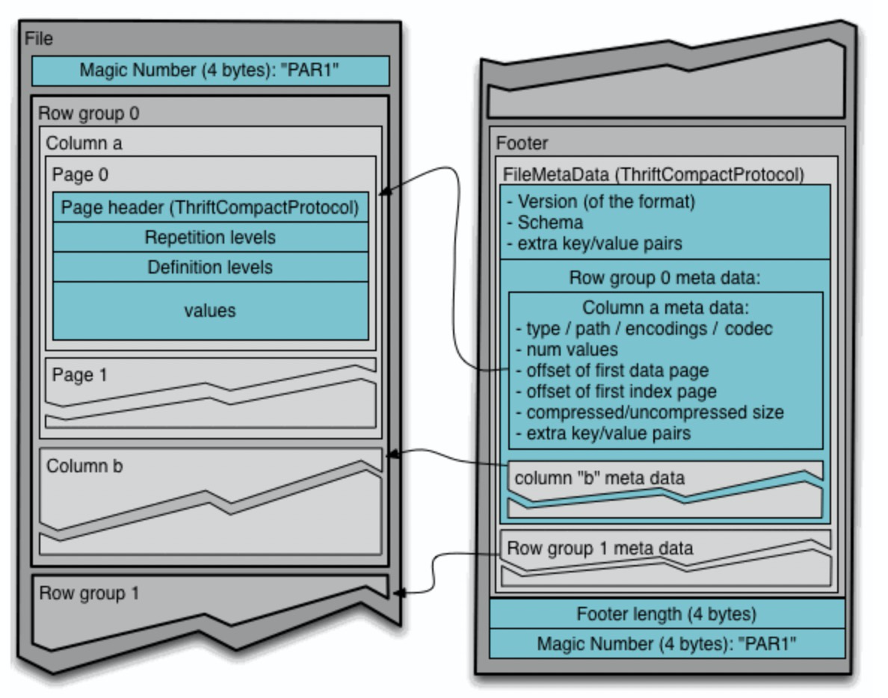

[toc]

## 数据分层调研

### hive

* 概念
  * hive是基于[Hadoop](https://baike.baidu.com/item/Hadoop/3526507)的一个[数据仓库](https://baike.baidu.com/item/数据仓库/381916)工具，用来进行数据提取、转化、加载，这是一种可以存储、查询和分析存储在Hadoop中的大规模数据的机制。hive数据仓库工具能将结构化的数据文件映射为一张数据库表，并提供[SQL](https://baike.baidu.com/item/SQL/86007)查询功能，能将[SQL语句](https://baike.baidu.com/item/SQL语句/5714895)转变成[MapReduce](https://baike.baidu.com/item/MapReduce/133425)任务来执行。Hive的优点是学习成本低，可以通过类似SQL语句实现快速MapReduce统计，使MapReduce变得更加简单，而不必开发专门的MapReduce应用程序。

* 底层存储格式(常用的存储格式)

  * 行式存储和列式存储

  

  

  * textFile：

    * hive 默认的存储格式（可以通过 [hive.default.fileformat](https://cwiki.apache.org/confluence/display/Hive/Configuration+Properties#ConfigurationProperties-hive.default.fileformat) 修改）数据不做压缩，磁盘开销比较大，数据解析开销大，TextFile格式可结合Gzip、Bzip2使用。

    * 存储方式：行存储

      **注意：使用Gzip压缩方式，hive不会对数据进行切分，从而无法对数据进行并行操作。**

  * SequenceFile

    * 二进制文件，以<key,value>形式序列化到文件中

    * 存储方式：行存储，可分割可压缩，一般选择block进行压缩

      **注意：件和Hadoop api中的mapfile是相互兼容的**

  * Avro file

    * 存储方式：行存储

    * 数据模型：固定的schema ，可以用数据存储和网络通信。

    * 文件结构：

      

      

    

  * Rcfile

    * 存储方式：列存储,

    * RCFile将表数据存储在由二进制键/值对组成的平面文件中

    * 文件存储：

      

      

      

      * 数据读取：在一般的列存储中，会将不同的列分开存储，这样在查询的时候会跳过某些列，但是有时候存在一个表的有些列不在同一个HDFS块上（如下图），所以在查询的时候，Hive重组列的过程会浪费很多IO开销。
         **劣势** 拷贝到本地目录后RCFile并不是真正直接跳过不需要的列，并跳到需要读取的列， 而是通过扫描每一个row group的头部定义来实现的，所以在读取所有列的情况下，RCFile的性能反而没有SequenceFile高。

  * Orcfile

    * 存储方式: 列存储

    * 数据模型

      和Parquet不同，ORC原生是不支持嵌套数据格式的，而是通过对复杂数据类型特殊处理的方式实现嵌套格式的支持，例如对于如下的hive表：

      ```sql
      CREATE TABLE `orcStructTable`(
        `name` string,
        `course` struct<course:string,score:int>,
        `score` map<string,int>,
        `work_locations` array<string>)
      ```

      

    

    * 文件结构：
      * 和Parquet类似，ORC文件也是以二进制方式存储的，所以是不可以直接读取，ORC文件也是自解析的，它包含许多的元数据，这些元数据都是同构ProtoBuffer进行序列化的。ORC的文件结构如图，其中涉及到如下的概念：

    

    

    

    * * 文件级别：postscript的区，它主要是用来存储压缩参数及压缩页脚的大小。ORC File的file footer还包含一些额外的辅助信息,file footer里面包含了该ORC File文件中stripes的信息，每个stripe中有多少行，以及每列的数据类型。当然，它里面还包含了列级别的一些聚合的结果，比如：count, min, max, and sum。
      * stripe级别：ORC File包含一组组的行数据，称为stripes,    在默认情况下，一个stripe的大小为250MB。大尺寸的stripes使得从HDFS读数据更高效。从上图我们可以看出，每个Stripe都包含index data、row data以及stripe footer。Index data包含每列的最大和最小值以及每列所在的行，Row data在表扫描的时候会用到，Stripe footer包含流位置的目录。

    

    * 数据访问：

      * 读取ORC文件是从尾部开始的，第一次读取16KB的大小，尽可能的将Postscript和Footer数据都读入内存。文件的最后一个字节保存着PostScript的长度，它的长度不会超过256字节，PostScript中保存着整个文件的元数据信息，它包括文件的压缩格式、文件内部每一个压缩块的最大长度(每次分配内存的大小)、Footer长度，以及一些版本信息。在Postscript和Footer之间存储着整个文件的统计信息(上图中未画出)，这部分的统计信息包括每一个stripe中每一列的信息，主要统计成员数、最大值、最小值、是否有空值等。

      * 读取文件的Footer信息，它包含了每一个stripe的长度和偏移量，该文件的schema信息(将schema树按照schema中的编号保存在数组中)、整个文件的统计信息以及每一个row group的行数。

      * 处理stripe时首先从Footer中获取每一个stripe的其实位置和长度、每一个stripe的Footer数据(元数据，记录了index和data的的长度)，整个striper被分为index和data两部分，stripe内部是按照row group进行分块的(每一个row group中多少条记录在文件的Footer中存储)，row group内部按列存储。每一个row group由多个stream保存数据和索引信息。每一个stream的数据会根据该列的类型使用特定的压缩算法保存。在ORC中存在如下几种stream类型：

        - PRESENT：每一个成员值在这个stream中保持一位(bit)用于标示该值是否为NULL，通过它可以只记录部位NULL的值
        - DATA：该列的中属于当前stripe的成员值。
        - LENGTH：每一个成员的长度，这个是针对string类型的列才有的。
        - DICTIONARY_DATA：对string类型数据编码之后字典的内容。
        - SECONDARY：存储Decimal、timestamp类型的小数或者纳秒数等。
        - ROW_INDEX：保存stripe中每一个row group的统计信息和每一个row group起始位置信息

      * 在初始化阶段获取全部的元数据之后，可以通过includes数组指定需要读取的列编号，它是一个boolean数组，如果不指定则读取全部的列，还可以通过传递SearchArgument参数指定过滤条件，根据元数据首先读取每一个stripe中的index信息，然后根据index中统计信息以及SearchArgument参数确定需要读取的row group编号，再根据includes数据决定需要从这些row group中读取的列，通过这两层的过滤需要读取的数据只是整个stripe多个小段的区间，然后ORC会尽可能合并多个离散的区间尽可能的减少I/O次数。然后再根据index中保存的下一个row group的位置信息调至该stripe中第一个需要读取的row group中。

        由于ORC中使用了更加精确的索引信息，使得在读取数据时可以指定从任意一行开始读取，更细粒度的统计信息使得读取ORC文件跳过整个row group

  * Parquet

    * 存储方式：列存储

    * 数据模型：

      * Parquet支持嵌套的数据模型，类似于Protocol Buffers，每一个数据模型的schema包含多个字段，每一个字段有三个属性：重复次数、数据类型和字段名，重复次数可以是以下三种：required(只出现1次)，repeated(出现0次或多次)，optional(出现0次或1次)。每一个字段的数据类型可以分成两种：group(复杂类型)和primitive(基本类型)。例如Dremel中提供的Document的schema示例，它的定义如下：

        ```java
        message Document {
          required int64 DocId;
          optional group Links {
            repeated int64 Backward;
            repeated int64 Forward; 
          }
          repeated group Name {
            repeated group Language {
              required string Code;
              optional string Country; 
             }
            optional string Url; 
          }
        }
        ```

      

    * 文件结构：

      Parquet文件是以二进制方式存储的，是不可以直接读取和修改的，Parquet文件是自解析的，文件中包括该文件的数据和元数据。在HDFS文件系统和Parquet文件中存在如下几个概念：

      * HDFS块(Block)：它是HDFS上的最小的副本单位，HDFS会把一个Block存储在本地的一个文件并且维护分散在不同的机器上的多个副本，通常情况下一个Block的大小为256M、512M等。
      * HDFS文件(File)：一个HDFS的文件，包括数据和元数据，数据分散存储在多个Block中
      * 行组(Row Group)：按照行将数据物理上划分为多个单元，每一个行组包含一定的行数，在一个HDFS文件中至少存储一个行组，Parquet读写的时候会将整个行组缓存在内存中，所以如果每一个行组的大小是由内存大的小决定的。
      * 列块(Column Chunk)：在一个行组中每一列保存在一个列块中，行组中的所有列连续的存储在这个行组文件中。不同的列块可能使用不同的算法进行压缩。
      * 页(Page)：每一个列块划分为多个页，一个页是最小的编码的单位，在同一个列块的不同页可能使用不同的编码方式。

      通常情况下，在存储Parquet数据的时候会按照HDFS的Block大小设置行组的大小，由于一般情况下每一个Mapper任务处理数据的最小单位是一个Block，这样可以把每一个行组由一个Mapper任务处理，增大任务执行并行度。Parquet文件的格式如下图所示：

      

      * Magic Code，用于校验它是否是一个Parquet文件
      * Footer length存储了文件元数据的大小，通过该值和文件长度可以计算出元数据的偏移量。
      * FileMetaData 文件的元数据中包括每一个行组的元数据信息和当前文件的Schema信息 。
      * Page header 存储该页的元数据,
      * 在Parquet中，有三种类型的页：数据页、字典页和索引页。数据页用于存储当前行组中该列的值，字典页存储该列值的编码字典，每一个列块中最多包含一个字典页，索引页用来存储当前行组下该列的索引，目前Parquet中还不支持索引页，但是在后面的版本中增加。

    * 数据访问：

      * Parquet中原生就支持Project下推，执行查询的时候可以通过Configuration传递需要读取的列的信息，这些列必须是Schema的子集。
      * Parquet每次会扫描一个Row Group的数据，然后一次性得将该Row Group里所有需要的列的Cloumn Chunk都读取到内存中，每次读取一个Row Group的数据能够大大降低随机读的次数。Parquet在读取的时候会考虑列是否连续，如果某些需要的列是存储位置是连续的，那么一次读操作就可以把多个列的数据读取到内存。
      * Parquet还可以利用每一个row group生成的统计信息进行谓词下推，这部分信息包括该Column Chunk的最大值、最小值和空值个数。通过这些统计值和该列的过滤条件可以判断该Row Group是否需要扫描。

  * <font color='red'> hive，在各个文档提到的测试中，查询性能中，orc的性能比parquet高的。 </font>

    

* hive 四种表类型：
  * 内部表：就是一般的表，前面讲到的表都是内布标，当表定义被删除的时候，表中的数据随之一并被删除
  * 外部表：数据存在与否和表的定义互不约束，仅仅只是表对hdfs上相应文件的一个引用，当删除表定义的时候，表中的数据依然存在。
  * 分区表：相当于在hdfs，多加了一个路径。
  * 桶表：桶表是对某一列数据进行hash取值将数据打撒，然后放到不同的文件中存储。桶表是对某一列数据进行hash取值将数据打撒，然后放到不同的文件中存储。分桶的查询效率比分区后的查询效率低。桶表不能通过load的方式直接加载数据，只能从另一张表中插入数据

* hive执行引擎差别（性能测试）

  * 默认是mapreduce执行引擎。

    

  * 换执行引擎为spark：

    * 编译安装,hive on hive 必须下载源码 ，进行重新编译，因为spark 中spark SQL的支持 下载的包中都包含了hive包。

    * 编译的过程官网：https://cwiki.apache.org/confluence/display/Hive/Hive%20on%20Spark:%20Getting%20Started

      | 需要工具 | 版本号    |
      | -------- | --------- |
      | Jdk      | 1.8.0_191 |
      | Scala    | 2.11.8    |
      | maven    | 3.6.1     |
      | Hadoop   | 2.8.5     |
      | Spark    | 2.1.1     |
      | hive     | 2.3.8     |

    

* hive支持的数据类型：

  *  基本类型

    

  * 复杂类型：

    ​	


* 方案实现：

  * 数据写入：
    * DC分流出来，通过hive以parquet的文件格式写入到hdfs中，以时间分区。
    * 当需要查询1年以前的数据时，DA调用hive进行查询。进行前端dashboard的展示。

  * 缺点： 
    * 查询速度会很慢。
  * 优点
    * 不会增加过多的运维成本。

  


