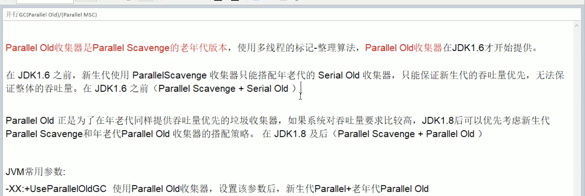

[toc]

#### 1.GC垃圾回收算法和垃圾回收器之间的关系，分别是什么？

* 算法和垃圾回收器之间的关系：

* 四种类垃圾回收器：

* 串行垃圾回收器（serial): 它为单线程环境设计并且只有一个线程进行垃圾回收,会暂停所有的用户线程，不适合用在服务器
* 并行垃圾回收器(Parallel): 多个线程并行工作，此时用户线程还是暂停的，适用于科学计算/大数据处理等弱交互场景
* 并发垃圾回收器(CMS): 用户线程和垃圾回收线程并发执行(不一定是并行，可能是交替执行)，不需要用户停顿用户线程，互联网公司多用他，适用于对响应时间有要求的场景
* G1垃圾回收器(G1):G1回收器将堆内存分割成不同的区域然后并发对其进行垃圾回收。

#### 2.怎么查看服务器默认的垃圾回收器是哪个？生产上如何配置垃圾回收器？对垃圾回收器的理解

* 查看服务器默认的垃圾回收器
  *  java   -XX:+PrintCommandLineFlags -version

* 生产上如何配置垃圾回收器：
  * -XX:+UseSerialGC

* 对垃圾回收器的理解

    GC日志中参数的说明

  * 
  * 
  * 

  * 串行收集器(Serial)

    

    

  * 并行收集器(ParNew)

    

​                                

   * ​			

        * 并行收集器(Parallel Scavenge)

          

 		                     

​                               

* 

  * 并行回收器（Parallel old ）

    

  * Current Mark Sweep(cms) 回收器 

    

  ​                      

  ​			    CMS四步骤：

  ​					（1）初始标记(CMS initial mark):只是标记一下GCroot直接关联的对象，速度很快，扔需要暂停所有的线程

  ​					（2）并发标记(CMS concurrent mark):和线程一起进行GCroot跟踪的过程，和用户线程一起工作，不需要暂停工作线                     

  ​                              程，主要标记过程，标记全部的对象。

  ​					（3）重新标记(GC remark):为了修正并发标记期间，因程序继续运行而导致标记产生变动的那一部分标记对象记录，

  ​							 仍然需要暂停所有的工作线程。由于并发标记时，用户线程依然在执行，因此在正式清理前，再做修正。

  ​					 （4）并发清除(CMS current mark sweep)和用户线程一起：清除了GC root不可达对象，和用户线程一起工作，不需要

  ​							  暂停工作线程，基于标记结果，直接清理对象，由于耗时最长的并发标记和并发清除工作垃圾回收线程可以和工作

  ​							  线程一起工作，所以整体来看CMS的内存回收和用户线程是一起并发的执行。

  ​				CMS的优点和缺点：

  ​						（1）优点：并发收集低停顿

  ​						（2）缺点：并发收集，对CPU的压力大，由于并发进行，CMS在收集和应用程序同时会增大对堆内存的占用，也就是

  ​                                             说CMS必须在老年代堆内存用完之前完成垃圾回收，否则CMS回收失败时，会触发担保机制，串行老年代

  ​											  收集器将以STW的方式进行一次GC，从而造成较大的停顿时间。

  ​                                          ：采用标记清除，会导致大量的碎片。老年代会随着应用时长被耗尽，最后将不得不通过担保机制对内存

  ​											  进行压缩，CMS也提供了参数-XX：CMSFullGCsBeforeCompaction（默认是0，即每次都进行内存整   

  ​                                               理）指定在执行多少次CMS之后，执行一次压缩的Full GC。

#### 3.G1垃圾回收器

* 什么是G1垃圾回收器

  

  ​						

  

* 特点

  ​                     

* 底层原理：

  

  

​                                                                                                              

​		

* 执行的过程：

​                                              

* 设置参数：

  

* G1回收器和CMS回收器的区别：

  

#### 4.生产服务变慢了，诊断思路和性能评估

* top 命令查看整机

  <1>主要是要查看cop和mem使用占比

  <2>还有load average 系统的负载均衡的三个数字：分别代表是系统一分钟，五分钟，十五分钟的系统负载，如果三个值相加除以3再乘以100%值大于60% 表示系统的负载比较高

   <3>这个命令不停的按1 ，会显示每个cpu核的使用。就可以确定是哪个cpu核使用比较高

* vmstat查看cpu

  

  mpstat

* pidstat / free查看内存

* df 查看磁盘空间

* iostat 查看磁盘IO

  

* ifstat 查看网络IO

