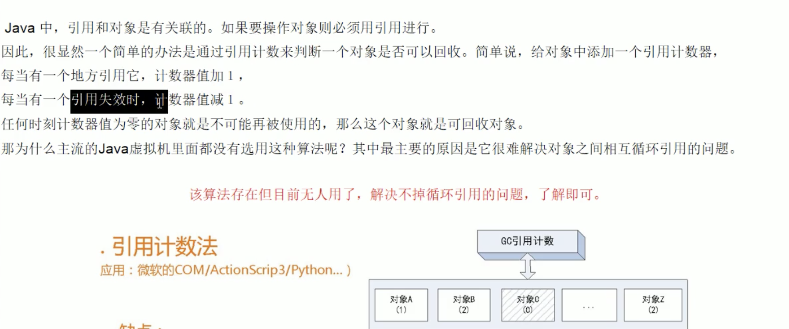
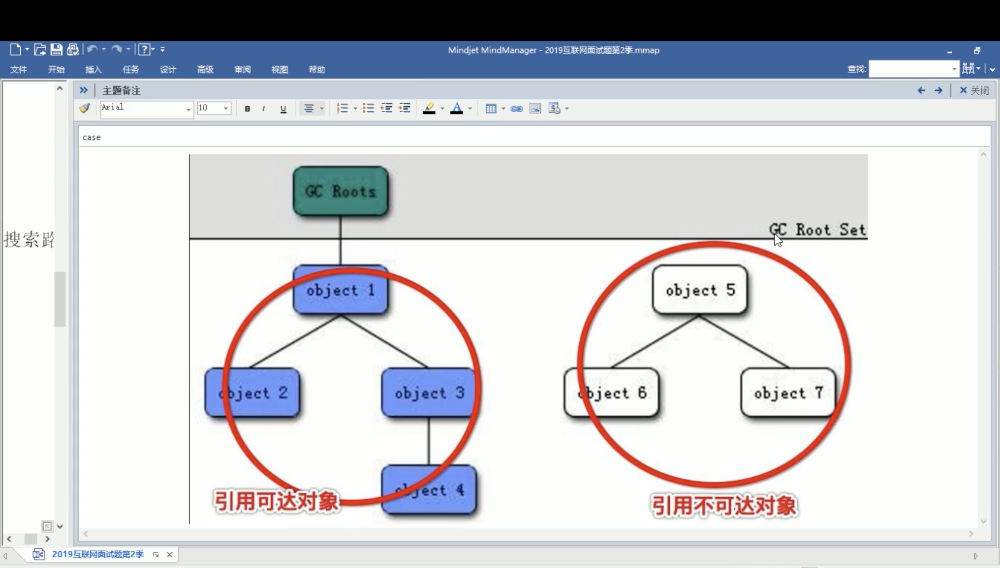
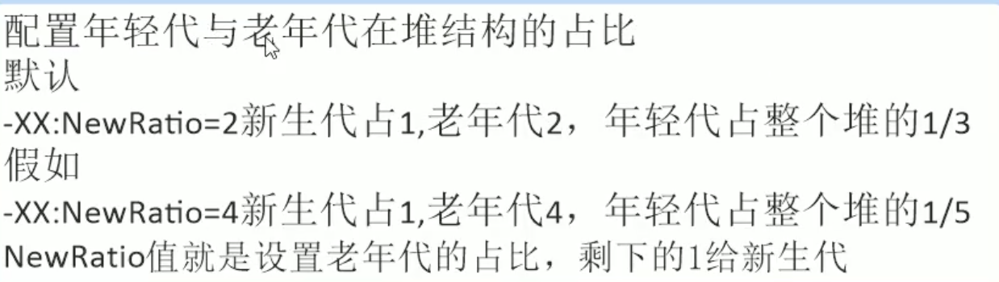
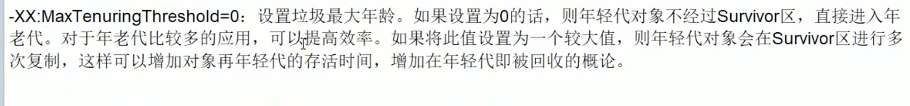
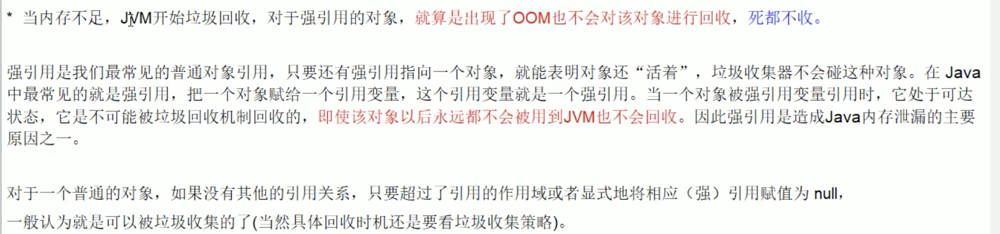
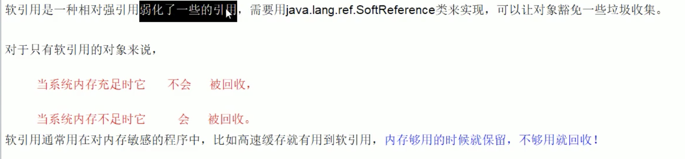
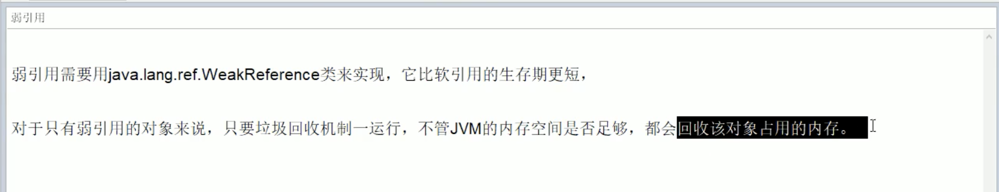
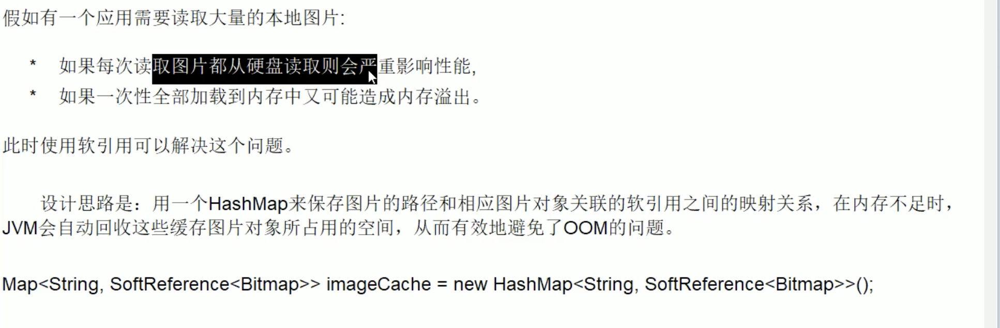
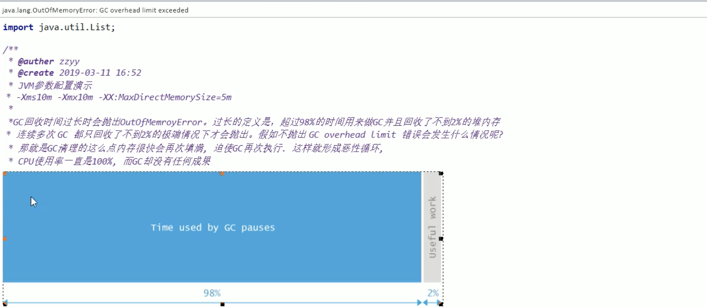
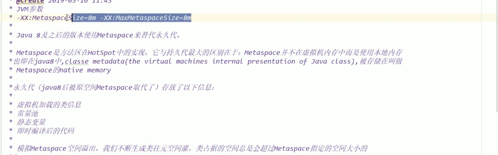

[toc]

#### 1.什么是垃圾

```
内存中不再使用的空间就是垃圾。
```

#### 2.如何判断一个对象可以做垃圾回收？

* 引用计数法：

  

  

* 枚举根节点可达点


​                                               

  



* 什么样的对象可以做到GC root对象

  

#### 3.盘点查看JVM系统默认值

* jvm参数类型

  * 标配类型(jdk各个版本之间很稳定，很少有大的变化)

    * -version
    * -help
    * java -showversion

  * X参数（了解）

    * -Xint  解释执行
    * -Xcomp  第一次使用就编译成本地代码
    * -Xmixed 混合模式（先编译再执行）

  * XX参数

    * Boolean类型：
      *  jps -l  输出结果:(83345 com.zyj.play.interview.questions.jvm.HelloGc) 输出java进程名字和java进程号
      *  Jinfo -flag PrintGcDetails 83345  输出结果: (-XX:-PrintGCDetails) 输出该java进程中配置jvm参数+号表示有，-号表示没有
      *  Jinfo -flags 83345 输出结果：该线程所有的默认的jvm配置
    * kv设置值(公式：-XX:属性key=属性值value):
      * -XX:MetaspaceSize=128M  jinfo -flag MetaspaceSize 83870  当matespace空间达到128M的时候，就会触发metaspace GC
      * -XX:MaxTenuringThreshold=15 : 表示的是年龄到了15可以到老年区

  * <font color=red> 坑题</font>

    * -Xms -Xmx 两个经典的参数，算是哪种参数类型。这个如何解释（java -Xms256m -Xmx2048m）
      * 其实-Xms 就是等于 -XX:initialHeapSize
      * -Xmx 就是等于 -XX:MaxHeapSize

  * 第二种盘点jvm系统默认值

    * java -XX:+PrintFlagsInitial (JVM初始化值)

      ```
      [Global flags]
           intx ActiveProcessorCount                      = -1                                  {product}
          uintx AdaptiveSizeDecrementScaleFactor          = 4                                   {product}
          uintx AdaptiveSizeMajorGCDecayTimeScale         = 10                                  {product}
           bool AdjustConcurrency                         = false                               {product}
           bool AggressiveHeap                            = false                               {product}
           bool AggressiveOpts                            = false                               {product}
           intx AliasLevel                                = 3                                   {C2 product}
           bool AlignVector                               = true                                {C2 product}
           intx AllocateInstancePrefetchLines             = 1                                   {product}
           intx AllocatePrefetchDistance                  = -1                                  {product}
      ```

    * java -XX:+PrintFlagsFinal（JVM修改更新的值）

      ???+note "返回结果有= 和:=

      其中=表示的就是初始值，:=表示已经人为修改过的或者已经被JVM修改过的

    * java -XX:+PrintCommandLineFlags(最厉害的是打印出jvm所使用的垃圾回收器)

      ```
      -XX:InitialHeapSize=268435456 -XX:MaxHeapSize=4294967296 -XX:+PrintCommandLineFlags -XX:+UseCompressedClassPointers -XX:+UseCompressedOops -XX:+UseParallelGC
      java version "1.8.0_221"
      Java(TM) SE Runtime Environment (build 1.8.0_221-b11)
      Java HotSpot(TM) 64-Bit Server VM (build 25.221-b11, mixed mode)
      ```

#### 4.JVM常用的基本配置参数

* -Xms

  * 初始大小堆内存，默认为物理内存的1/64。等价于-XX:InitialHeapSize

* -Xmx

  * 最大分配内存，默认为物理内存的1/4。等价于-XX:MaxHeapSize

* -Xss

  * 设置单个线程栈的大小，一般默认是512k~1024K。等价于-XX:ThreadStackSize

* -Xmn

  * 设置新生代的大小

* -XX: MetaspaceSize

  * 设置元空间大小，元空间的本质和永久代相似，都是对JVM规范中方法区的实现。不过元空间和永久代之间最大的区别是：

    元空间并不是在虚拟机中，而是在本地内存。因此默认情况下元空间受本地内存空间的限制。

  * new 出新的对象为什么会把元空间撑爆呢？毕竟new出新对象是放在堆里面的
    
    * 大量new对象生成大量的类模板信息，而类的模板信息正是放在方法区的，理论上只要堆区只要足够大，生成了足够的类模板就有可能将元空间撑爆。

* -XX:+PrintGCDetails

  * 输出详细GC收集日志信息

    ```
    [GC (Allocation Failure) [PSYoungGen: 1345K->496K(2560K)] 1345K->528K(9728K), 0.0031854 secs] [Times: user=0.01 sys=0.00, real=0.01 secs] 
    [GC (Allocation Failure) [PSYoungGen: 496K->464K(2560K)] 528K->504K(9728K), 0.0019800 secs] [Times: user=0.00 sys=0.00, real=0.00 secs] 
    [Full GC (Allocation Failure) [PSYoungGen: 464K->0K(2560K)] [ParOldGen: 40K->367K(7168K)] 504K->367K(9728K), [Metaspace: 2915K->2915K(1056768K)], 0.0067635 secs] [Times: user=0.03 sys=0.00, real=0.01 secs] 
    [GC (Allocation Failure) [PSYoungGen: 0K->0K(2560K)] 367K->367K(9728K), 0.0017003 secs] [Times: user=0.01 sys=0.01, real=0.00 secs] 
    [Full GC (Allocation Failure) [PSYoungGen: 0K->0K(2560K)] [ParOldGen: 367K->350K(7168K)] 367K->350K(9728K), [Metaspace: 2915K->2915K(1056768K)], 0.0067882 secs] [Times: user=0.02 sys=0.00, real=0.00 secs] 
    Heap
     PSYoungGen      total 2560K, used 81K [0x00000007bfd00000, 0x00000007c0000000, 0x00000007c0000000)
      eden space 2048K, 3% used [0x00000007bfd00000,0x00000007bfd14408,0x00000007bff00000)
      from space 512K, 0% used [0x00000007bff00000,0x00000007bff00000,0x00000007bff80000)
      to   space 512K, 0% used [0x00000007bff80000,0x00000007bff80000,0x00000007c0000000)
     ParOldGen       total 7168K, used 350K [0x00000007bf600000, 0x00000007bfd00000, 0x00000007bfd00000)
      object space 7168K, 4% used [0x00000007bf600000,0x00000007bf657a60,0x00000007bfd00000)
     Metaspace       used 2967K, capacity 4496K, committed 4864K, reserved 1056768K
      class space    used 323K, capacity 388K, committed 512K, reserved 1048576K
    Exception in thread "main" java.lang.OutOfMemoryError: Java heap space
    	at com.zyj.play.interview.questions.jvm.HelloGc.main(HelloGc.java:9)
    ```

                                                                                                                    

    ​                                           GC日志解读

    

    

    ​                                                             FullGC日志解读

* -XX:SurvivorRatio

  ​	

* -XX: NewRatio

     

* -XX:MaxTenuringThreshold(设置垃圾最大年龄)

  

  

#### 5.强引用，软引用，弱引用，虚引用分别是什么？

* 强引用

  

  ```java
  package com.zyj.play.interview.questions.jvm;
  /**
   * @author zhangyingjie
   */
  public class StrongReferenceDemo {
      public static void main(String[] args) {
          Object obj1 = new Object();
          Object obj2= new Object();
          obj1 = null;
          System.gc();
          System.out.println(obj2);
          System.out.println(obj1);
      }
  }
  ```

* 软引用

  

  ```json
  package com.zyj.play.interview.questions.jvm;
  
  import java.lang.ref.SoftReference;
  
  /**
   * @author zhangyingjie
   */
  public class SoftReferenceDemo {
      public void softMemoryEnough() {
          Object o1 = new Object();
          SoftReference<Object> o2 = new SoftReference<>(o1);
          o1 = null;
          System.gc();
          System.out.println(o1);
          System.out.println(o2.get());
      }
  
      public void softMemoryNotEnough() {
          Object o1 = new Object();
          SoftReference<Object> o2 = new SoftReference<>(o1);
          o1 = null;
          try {
              byte[] bytes = new byte[30 * 1024 * 1024];
          } catch (Exception e) {
              e.printStackTrace();
          } finally {
              System.out.println(o1);
              System.out.println(o2.get());
          }
      }
  
      public static void main(String[] args) {
          SoftReferenceDemo softReferenceDemo = new SoftReferenceDemo();
  //        softReferenceDemo.softMemoryEnough();
          softReferenceDemo.softMemoryNotEnough();
      }
  }
  ```

* 弱引用

  

  

  ```java
  package com.zyj.play.interview.questions.jvm;
  
  import java.lang.ref.WeakReference;
  
  /**
   * @author zhangyingjie
   */
  public class WeakReferenceDemo {
      public static void main(String[] args) {
          Object o1 = new Object();
          WeakReference<Object> o2 = new WeakReference<>(o1);
          System.out.println(o1);
          System.out.println(o2.get());
          o1 = null;
  
          System.gc();
          System.out.println("=========================");
          System.out.println(o1);
          System.out.println(o2.get());
      }
  }
  ```

  * 软引用和弱引用的使用场景

  

  * WeekHashMap

    ```java
    package com.zyj.play.interview.questions.jvm;
    
    import java.util.HashMap;
    import java.util.Map;
    import java.util.WeakHashMap;
    
    /**
     * @author zhangyingjie
     */
    public class WeakHashMapDemo {
        public static void main(String[] args) {
            com.zyj.play.interview.questions.jvm.reference.WeakHashMapDemo weakHashMapDemo = new com.zyj.play.interview.questions.jvm.reference.WeakHashMapDemo();
            weakHashMapDemo.myHashMap();
            weakHashMapDemo.myWeakHashMap();
        }
    
        public void myHashMap() {
            Map<Integer, String> map = new HashMap<>();
            Integer key = new Integer(1);
            String value = "HashMap";
            map.put(key, value);
            System.out.println(map);
            key = null;
            System.out.println(map);
            System.gc();
            System.out.println(map + "\t " + map.size());
        }
    
        public void myWeakHashMap() {
            Map<Integer, String> map = new WeakHashMap<>();
            Integer key = new Integer(2);
            String value = "WeakHashMap";
            map.put(key, value);
            System.out.println(map);
            key = null;
            System.out.println(map);
            System.gc();
            System.out.println(map + "\t " + map.size());
        }
    }
    ```

* PhantomReference

  

```java
package com.zyj.play.interview.questions.jvm;

import java.lang.ref.ReferenceQueue;
import java.lang.ref.WeakReference;

/**
 * @author zhangyingjie
 */
public class ReferenceQueueDemo {
    public static void main(String[] args) {
        Object o1 = new Object();
        ReferenceQueue<Object> referenceQueue = new ReferenceQueue<>();
        WeakReference<Object> weakReference = new WeakReference<>(o1, referenceQueue);
        System.out.println(o1);
        System.out.println(weakReference.get());
        System.out.println(referenceQueue.poll());

        o1 = null;
        System.gc();
        System.out.println(o1);
        System.out.println(weakReference.get());
        System.out.println(referenceQueue.poll());
    }
}
```

#### 6.谈谈你对oom的认识


* Java.lang.StackOverflowError

```java
package com.zyj.play.interview.questions.jvm.oom;
/**
 * @author zhangyingjie
 */
public class StackOverflowErrorDemo {
    public static void main(String[] args) {
        stackOverflowError();
    }
    public static void stackOverflowError(){
        stackOverflowError();//Exception in thread "main" java.lang.StackOverflowError
    }
}
```

* java.lang.OutOfMemoryError:java heap space

```java
package com.zyj.play.interview.questions.jvm.oom;
import java.util.Random;
/**
 * @author zhangyingjie
 */
public class JavaHeapSpace {
    public static void main(String[] args) {
        String str = "atBS";
        while (true) {//Exception in thread "main" java.lang.OutOfMemoryError: Java heap space
            str += str + new Random().nextInt(111111)+new Random().nextInt(222222);
            str.intern();
        }
    }
}
```

* Java.lang.OutofMemoryError:GC overhead limit exceeded

  https://blog.csdn.net/hotthought/article/details/82987428(记一次jvm疯狂gc导致CPU飙高的问题解决)

  

  

 ```java
package com.zyj.play.interview.questions.jvm.oom;

import java.util.ArrayList;
import java.util.List;

/**
 * @author zhangyingjie
 */
public class GcOverheadLimitExceededDemo {
    public static void main(String[] args) {
        int i=0;
        List<String> list=new ArrayList<>();
        try {
            while (true){
                list.add(String.valueOf(++i).intern());
            }
        }catch (Throwable e){//Exception in thread "main" java.lang.OutOfMemoryError: GC overhead limit exceeded
            System.out.println("**********************i: "+i);
            e.printStackTrace();
            throw e;
        }
    }
}
 ```

* Java.lang.OutofMemoryError:Direct buffer memory

  

```java
package com.zyj.play.interview.questions.jvm.oom;

import java.nio.ByteBuffer;

/**
 * @author zhangyingjie
 */
public class GcBufferMemory {
    public static void main(String[] args) {
        System.out.println("配置的maxDirectMemory:" + sun.misc.VM.maxDirectMemory());
        try {
            Thread.sleep(3000);
        } catch (InterruptedException e) {//Exception in thread "main" java.lang.OutOfMemoryError: Direct buffer memory
            e.printStackTrace();
        }

        ByteBuffer bb = ByteBuffer.allocateDirect(6 * 1024 * 1024);
    }
}
```

* Java.lang.OutofMemoryError: unable to create new native thread

  

Linux 最高的线程上限是1024，这里可以修改。


```java
package com.zyj.play.interview.questions.jvm.oom;
/**
 * @author zhangyingjie
 */
public class CanNotCreateNativeThreadDemo {
    public static void main(String[] args) {
        for (int i = 0; ; i++) {
            System.out.println("***************************i:" + i);
            new Thread(() -> {
                try {
                    Thread.sleep(Integer.MAX_VALUE);
                } catch (InterruptedException e) {
                    e.printStackTrace();
                }
            }, "" + i).start();
        }
    }
}
```

* java.long.OutofMemoryError:Metaspace

  

```java
package com.zyj.play.interview.questions.jvm.oom;

import net.sf.cglib.proxy.Enhancer;
import net.sf.cglib.proxy.MethodInterceptor;
import net.sf.cglib.proxy.MethodProxy;

import java.lang.reflect.Method;

/**
 * @author zhangyingjie
 */
public class MetaspaceOomDemo {
    static class OOMTest {
    }

    public static void main(String[] args) {
        int i = 0;
        try {
            while (true) {
                i++;
                Enhancer enhancer = new Enhancer();
                enhancer.setSuperclass(OOMTest.class);
                enhancer.setUseCache(false);
                //Caused by: java.lang.OutOfMemoryError: Metaspace
                enhancer.setCallback(new MethodInterceptor() {
                    @Override
                    public Object intercept(Object obj, Method method, Object[] args, MethodProxy proxy) throws Throwable {
                        return proxy.invokeSuper(obj, args);
                    }
                });
                enhancer.create();
            }
        } catch (Exception e) {
            System.out.println("*******************多少次发生了异常" + i);
            e.printStackTrace();
        }
    }
}
```


 


​	


