[toc]

#### 一.AQS(abstract queue synchronizer)

* 字面意思：抽象的队列同步器

* 技术解释：

  

* 为什么AQS是juc最重要的基石的部分呢？

  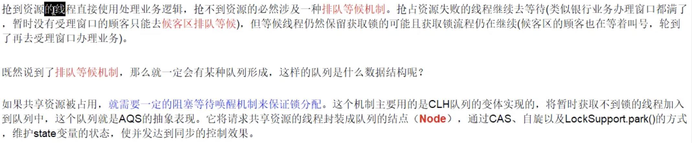

#### 二.AQS 初步

* 官网初步讲解：

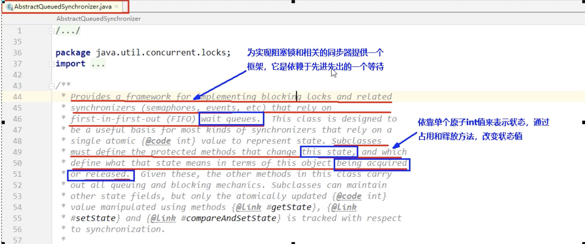

* 源码：

  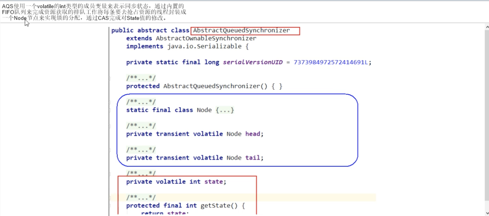

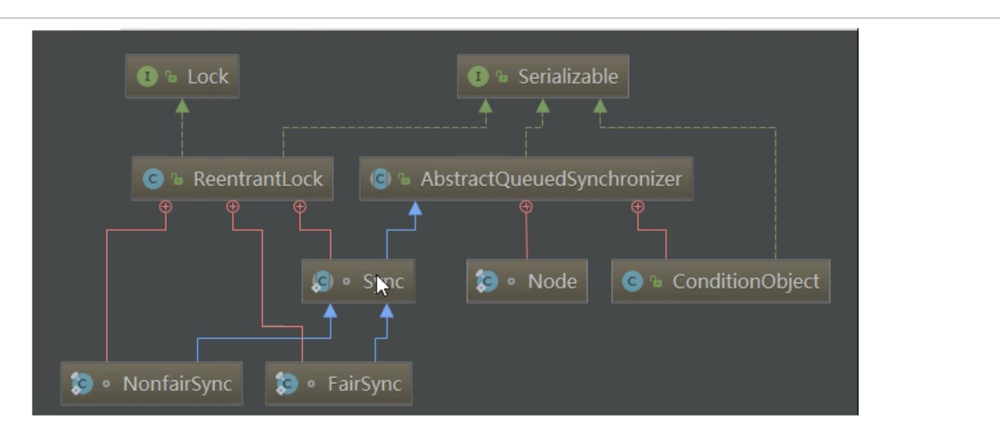

* AQS 的内部体系架构：

  * AQS int 变量  private volatile  int state;值为0，1  通过此值来判断是否阻塞
  * AQS的CLH队列:CLH队列是三个大神的缩写，是一个双向队列，比拟为银行客区的等待顾客

* 小总结：

  * 有阻塞就需要排队，实现排队必然需要队列
  * AQS=state变量+CLH变种的双端队列

* Node

  * waitStatus说的是每个节点的状态
  * state说的是aqs当前的阻塞转态

* 内部结构

  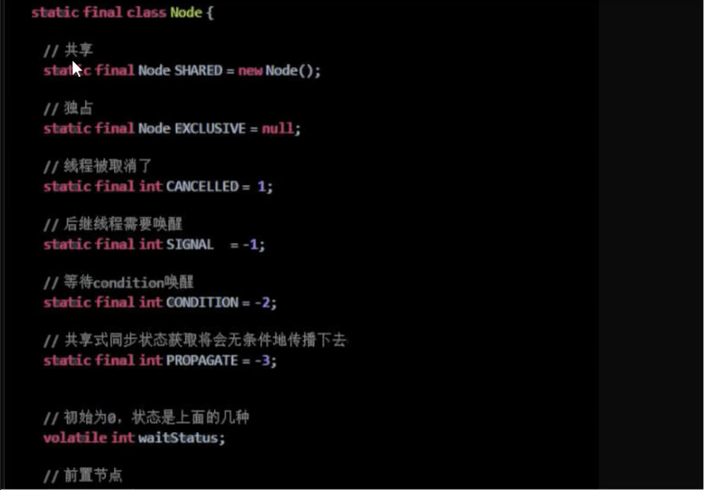

* 属性说明

  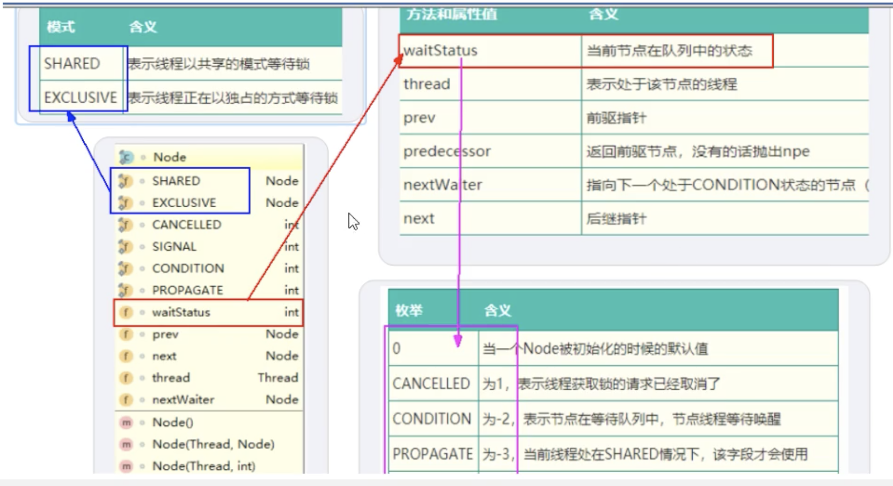

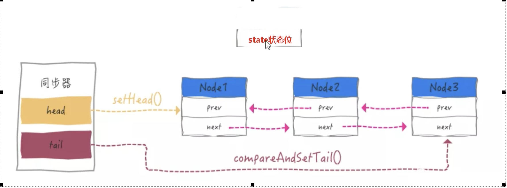

* 源码解读

  * Lock接口的实现类，基本都是通过聚合了一个队列同步器的子类完成线程访问控制的

    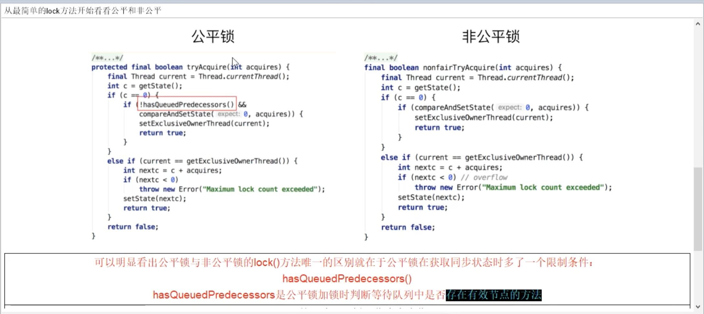

  * 非公平锁走起，方法lock

    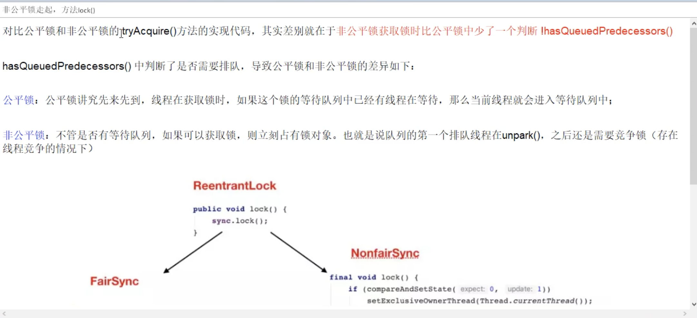

    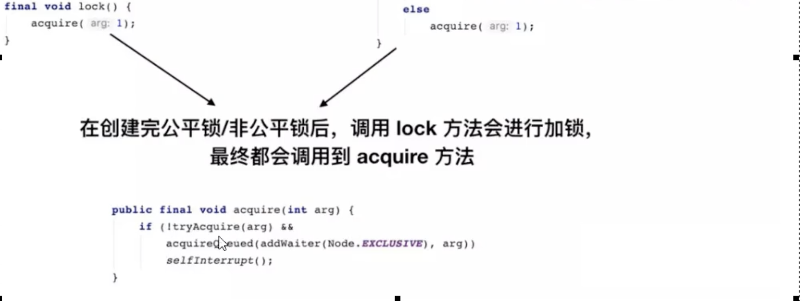

  * 总结

    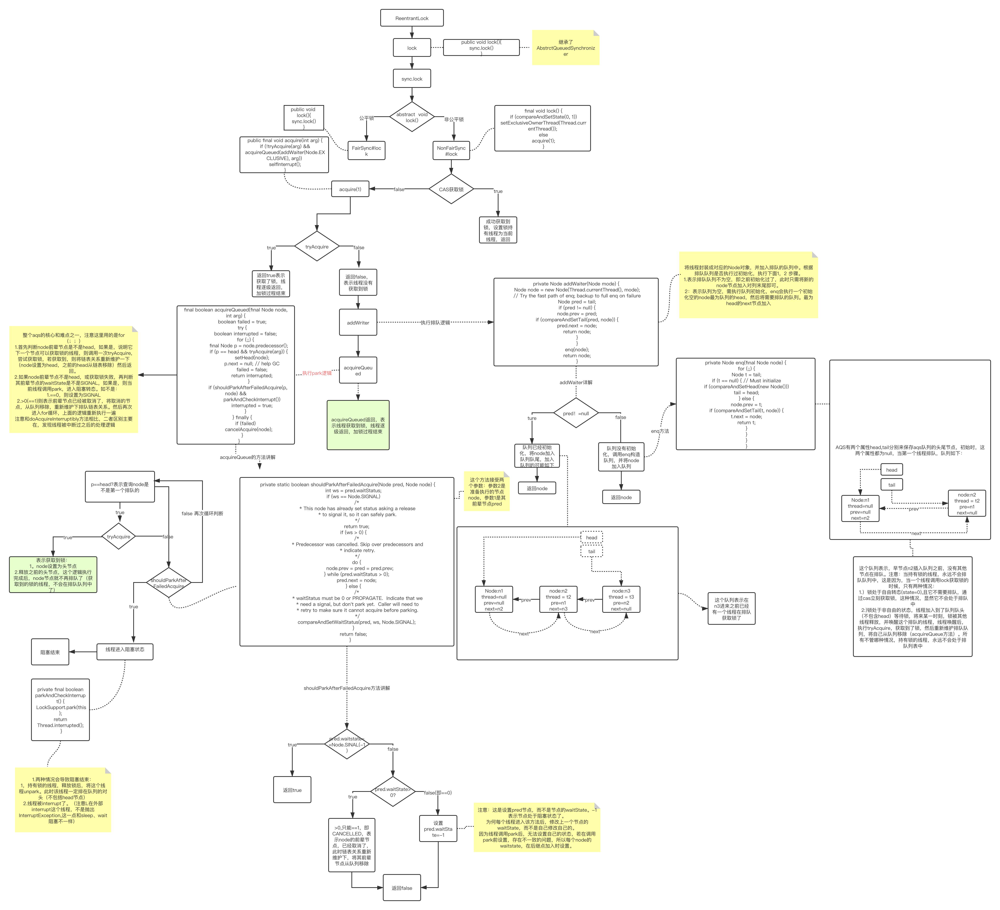

