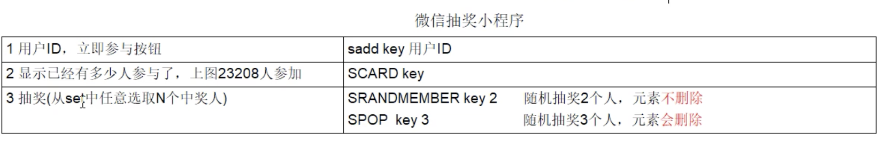

[toc]

#### 1.安装redis6.0.8是比较稳定的版本

#### 2.redis 的五大基本类型

*  sting(字符类型)
* list(列表类型)
* hash(散列类型)
* set(集合类型)
* zset(有序集合类型 sorted set)

#### 3.其他类型

*  bitMap（位图）
* HeperLogLog（统计）
* GEO（地理）
* stream

#### 4.备注：

* 命令是不分大小写的，但是key分大小写
* 帮助命令help@XX  eg: help@string 会出现和string相关的命令。

#### 5.使用场景

* 

* 

* 

  ​	                                                        

  

* 

  ​																                           微信抽奖小程序

  

  

  ​																	                            微信朋友圈

  

  ​																								公共关注

  

  ​																			QQ内推可能认识的人

  

* 

  

#### 6 分布式锁

*  知道分布式锁嘛？
  
  * jvm层面加的锁，是单机版的锁。分布式微服务架构，拆分各个微服务之间为了避免冲突和数据故障而加入的一把锁，分布式锁。是两种不同的东西
  
* 有哪些实现方案
  * mysql
  * zookpeer
  * redis
  * 一般互联网公司，大家习惯用redis作为分布式锁
  
* 谈谈你对redis分布式锁的理解？
  
  * redis->redlock==>redisson   lock/unlock 方法来实现分布式锁
  
* 删除key的时候有什么问题？

* 面试题

  * redis除了拿来做缓存，你还见过redis的什么用法

  * redis来做分布式锁的时候，需要注意什么问题

  * 如果redis单点部署，需要注意什么问题

  * 集群模式下，比如主从模式，有什么问题呢

  * 那你简单的介绍下一Redlock吧，你简历上redisson，你谈谈

  * redis分布式锁如何续期，看门狗知道嘛

    